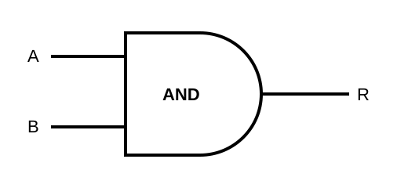
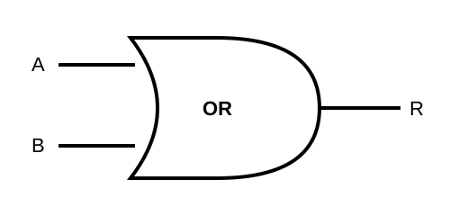
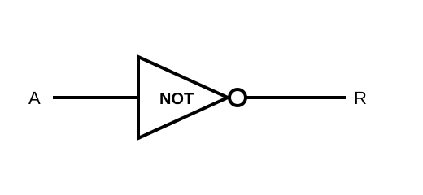
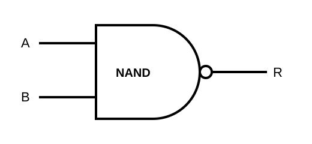
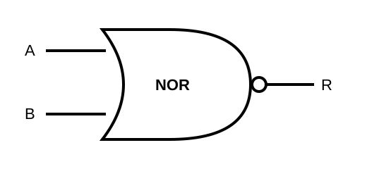
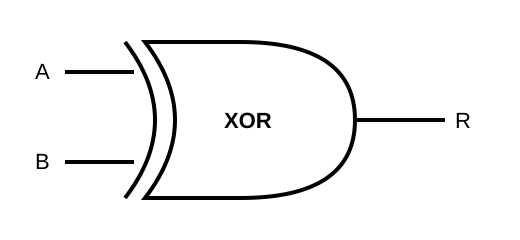

# Digital Logic

## Computing Logic

* Computers process data using **binary (base 2) numbers**.
* At the hardware level, electricity can be represented as either:

  * **1** = on
  * **0** = off
* Computers process data using electronic switches called **gates** or **logic gates** that control the flow of electrical signals.
* All computer logic can be built using three basic logic gates:

  * **AND**
  * **OR**
  * **NOT**
* Three additional logic gates are often used to simplify circuits:

  * **NAND**
  * **NOR**
  * **XOR**
* Logic gates are combined to form **circuits** that perform processing.

---

## AND Gate



An **AND gate** has two inputs and one output.

* `A` and `B` are the **inputs**.
* `R` is the **result** or output.
* The result is `1` **only when both inputs are `1`**.

### AND Truth Table

| A | B | R |
| - | - | - |
| 0 | 0 | 0 |
| 0 | 1 | 0 |
| 1 | 0 | 0 |
| 1 | 1 | **1** |

The rows are written in binary counting order:

```text
00
01
10
11
```

These are the binary representations of decimal values `0`, `1`, `2`, and `3`.

---

## OR Gate



An **OR gate** has two inputs and one output.

* If **one or more inputs are `1`**, the result is `1`.
* The result is `0` only when **both inputs are `0`**.

### OR Truth Table

| A | B | R |
| - | - | - |
| 0 | 0 | 0 |
| 0 | 1 | **1** |
| 1 | 0 | **1** |
| 1 | 1 | **1** |

---

## NOT Gate



A **NOT gate** has only **one input**.

The NOT gate reverses, or **toggles**, the input:

* `1` becomes `0`
* `0` becomes `1`

### NOT Truth Table

| A | R |
| - | - |
| 0 | **1** |
| 1 | 0 |

---

## NAND Gate

> **NAND will not be on the assessment.**



A **NAND gate** is an AND operation followed by a NOT operation.

It produces the **opposite result of an AND gate**.

### NAND Truth Table

| A | B | R |
| - | - | - |
| 0 | 0 | **1** |
| 0 | 1 | **1** |
| 1 | 0 | **1** |
| 1 | 1 | 0 |

---

## NOR Gate

> **NOR will not be on the assessment.**



A **NOR gate** is an OR operation followed by a NOT operation.

It produces the **opposite result of an OR gate**.

### NOR Truth Table

| A | B | R |
| - | - | - |
| 0 | 0 | **1** |
| 0 | 1 | 0 |
| 1 | 0 | 0 |
| 1 | 1 | 0 |

---

## XOR Gate

> **XOR will not be on the assessment.**



**XOR** means **exclusive OR**.

Think of XOR as:

> **One or the other, but not both.**

The result is `1` when either `A` or `B` is `1`, **but not when both are `1`**.

### XOR Truth Table

| A | B | R |
| - | - | - |
| 0 | 0 | 0 |
| 0 | 1 | **1** |
| 1 | 0 | **1** |
| 1 | 1 | 0 |

---

# Circuits

* Logic gates are combined to form **circuits**.
* Circuits use combinations of gates to perform processing.
* To determine the result of a circuit, follow the flow from the **inputs on the left** through each gate to the **output on the right**.

## Number of Input Combinations

For two inputs (`A` and `B`), there are **4 possible input combinations**:

```text
00
01
10
11
```

For three inputs (`A`, `B`, and `C`), there are **8 possible input combinations**:

```text
000
001
010
011
100
101
110
111
```

In general, the number of possible input combinations is:

```text
2^n
```

where `n` is the number of inputs.

---

# Hardware Circuits

Real computer circuits are built using electronic components etched onto **silicon chips**.

* Electrical voltage can be used to represent a binary `1`.
* Little or no voltage can represent a binary `0`.
* A single integrated circuit may contain multiple logic gates.
* A **pinout diagram** shows where the inputs, outputs, power, and other connections are located on a chip.

For example, a logic chip might contain **four AND gates** on a single integrated circuit.

Modern processors contain **billions of transistors**, which are combined to implement logic gates and much more complex circuits.

---

# CircuitVerse

[**CircuitVerse**](https://circuitverse.org/) is an online tool for building and testing digital logic circuits.

You can use CircuitVerse to:

* Add logic gates to a circuit.
* Connect gates together.
* Change input values between `0` and `1`.
* Observe how signals move through the circuit.
* Determine the final output.
* Test whether a circuit produces the expected results.

When working with a circuit, follow the signals **from left to right**, determining the output of each gate as you go.


Test these gates with CircuitVerse

- <a href="https://circuitverse.org/simulator/embed/and-gate-668e59f1-b782-40b7-bea4-855d5ac65f8b">AND gate - CircuitVerse</a>

- <a href="https://circuitverse.org/users/26691/projects/or-gate-99badba6-9a45-4013-8912-5eb0f5d2ac7b">OR gate - CircuitVerse</a>

- <a href="https://circuitverse.org/users/26691/projects/not-gate-c4fa7c72-7570-466c-b970-4f76dd782f60">NOT gate - CircuitVerse</a>


