# Operating Systems

**CS 111 — Introduction to Computer Science**  
**Prof. Lehman**

## Operating Systems

The **operating system (OS)** is software that **manages computer resources** and **provides an interface** for interaction with the user.

The OS **supports all of the apps** (also called programs or applications) that you run on your computer. The OS serves as a common interface between applications and the computer's resources.

The operating system has **three main functions**:

1. **Manage physical resources** (memory, hardware, etc.)
2. **Manage processes** (programs)
3. **Provide a user interface**

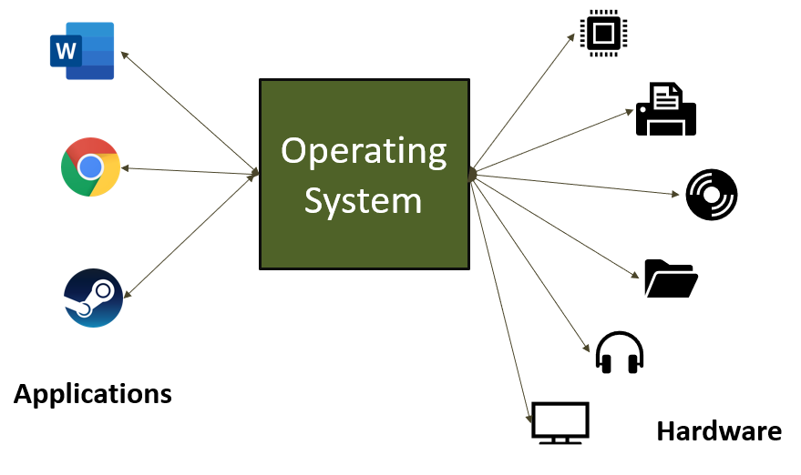

## Supporting Applications

The Chrome browser is an application. The Word word processing program is an application. Both of these applications—i.e., **apps**—need the Windows operating system to be able to run on our computers in the lab.

Windows decides:

- Where the program will be stored in memory
- How files will be stored
- How documents will be printed
- When the application may use the CPU
- Which network traffic is given to each application


## Memory and Process States

The OS divides main memory into a number of **partitions**, which can be allocated to different programs and processes.

Modern operating systems support **multiprogramming**: keeping multiple programs in memory at one time (also called **multitasking**).

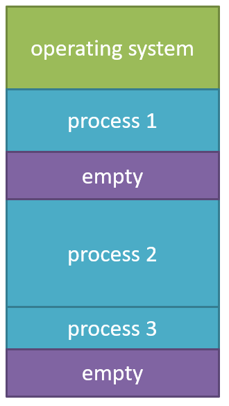

Each process can be in one of many states: **new, ready, running, waiting,** or **terminated**.

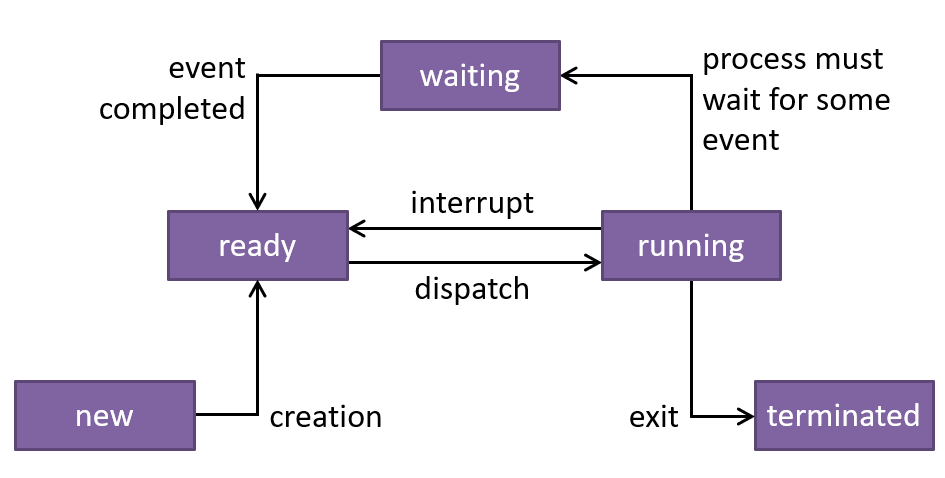

## CPU Scheduling

The OS determines how to share the CPU among all processes. This is called **CPU scheduling**.

Three main approaches:

- First-come, first-served
- Shortest job next
- Round-robin

The OS must prevent **deadlock**, which occurs when two processes each hold a resource the other needs, and each is waiting for the other to release its resource.

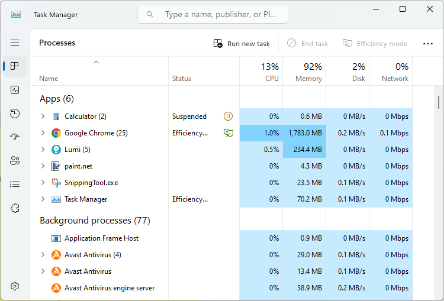

## User Interface

The OS provides a **user interface** so that a human can interact with the computer. This may be a **command line** or a **graphical user interface (GUI)**.

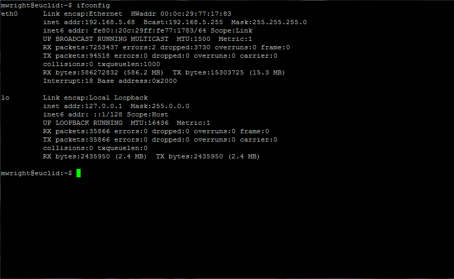

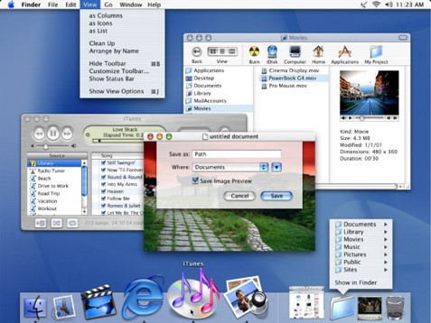

## Current Operating Systems

- **Microsoft Windows 11**
- **Apple Macintosh OS X 15**
- **Unix** — multi-user, multitasking OS commonly used on servers
- **Linux** — free version of UNIX for personal computers and servers; distributions include Red Hat, Ubuntu, Debian, and ChromeOS 129 (found on Chromebooks)
- **Google Android 15** — Linux-based OS for mobile devices
- **Apple iOS 18** — Apple's mobile operating system

> **Note:** Versions listed in the original presentation are as of September 2024.


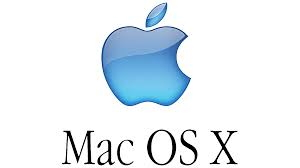

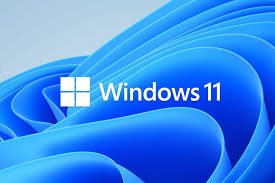


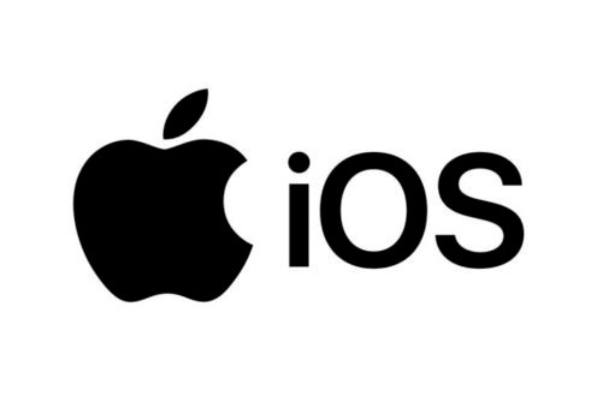

## Device Drivers

A **device driver** is a small program that helps the OS communicate with hardware devices.

Device drivers are necessary in order to use printers, digital cameras, external storage devices, etc.

Sources of device drivers:

- Included with the operating system
- Included with the device
- Available on the web


## Drives, Files, and Folders

A **file system** is a means of organizing files on a computer.

- **File:** a named collection of related data
- **Folder (or directory):** a logical grouping of files

Windows uses drive letters as the root, e.g., `C:\`. Mac/Linux systems start with the root `/`.

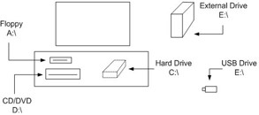

## File Manager

A **file manager** is a program that allows the user to manage files. Common tasks include **copying, renaming, moving, organizing, and deleting files and folders**.

A file manager allows the user to view file information such as the creation date and size of the file in bytes.

- Windows uses **File Explorer**.
- Macintosh uses **Finder**.

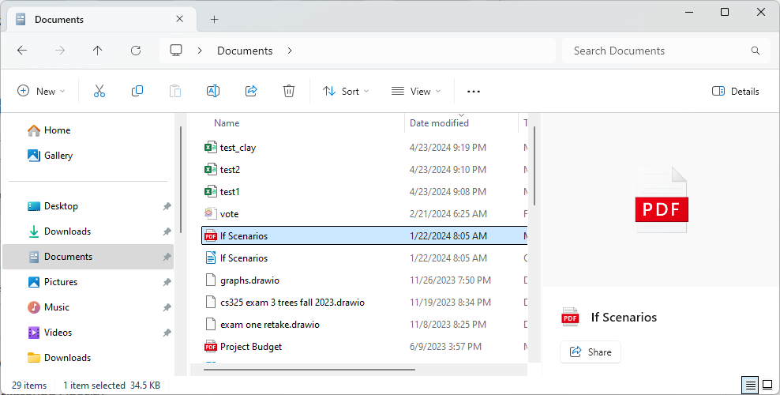

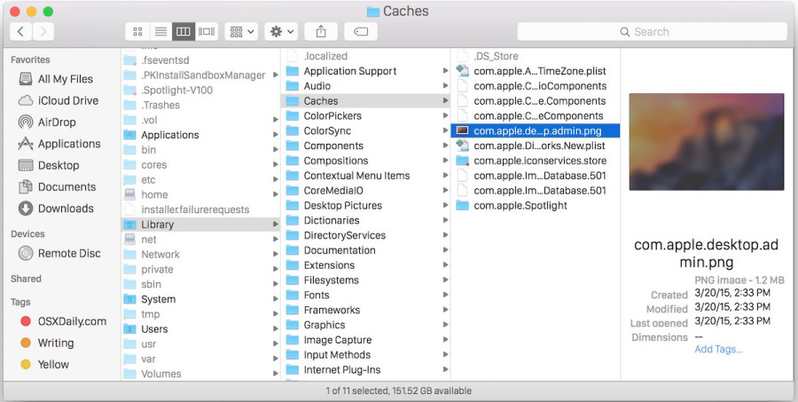

## File Types and Extensions

The **file type** indicates what kind of information the file contains and is commonly indicated by a three- or four-letter **file extension**.

For example: `mypage.html`

- Filename: `mypage`
- File extension: `.html`, indicating the file is a web page

> **Important:** Changing the file extension does **not** convert the data to a different format. For example, if you rename `document.docx` as `document.pdf`, you have not converted a Word document into a PDF document.

Windows relies on file extensions to determine file content, so it is important for Mac users to add the proper file extensions when sharing files with Windows users.

## Common File Types

| File Type | File Extension |
| --- | --- |
| Text files | `.txt` |
| Adobe Portable Document Format | `.pdf` |
| Word | `.docx` (older `.doc`) |
| Excel | `.xlsx` (older `.xls`) |
| Image file formats | `.jpg`, `.png`, `.gif`, `.heic`, `.bmp`, `.webp` |
| Audio file formats | `.mp3`, `.wav` |
| Windows executable / app | `.exe` |
| Zip file | `.zip` |
| HTML web page | `.html` |
| Cascading Style Sheet | `.css` |
| Python code | `.py` |
| Java code | `.java` |

## Folders and File Paths

Files are organized logically into **folders** (also called **directories**). Folders may be nested inside each other.

The entire collection of directories is called a **directory tree**, and the highest-level directory is called the **root directory**.

### Windows examples

```text
C:\Program Files\Mozilla Firefox\firefox.exe
C:\Users
```

### Mac/Linux examples

```text
/usr/local/share/fonts/times.otf
/Users/username/Documents/test.docx
```

## Command Line

| Task | Windows | Macintosh / Unix-like |
| --- | --- | --- |
| Show files in current folder | `dir` | `ls` |
| Display file contents | `type file1` | `cat file1` |
| Delete file | `del file1` | `rm file1` |
| Copy file | `copy file1 file2` | `cp file1 file2` |
| Rename file | `rename file1 file2` | `rn file1 file2` |
| Create folder | `mkdir folder1` | `mkdir folder1` |
| Change to folder | `cd folder1` | `cd folder` |
| Previous folder | `cd ..` | `cd ..` |
