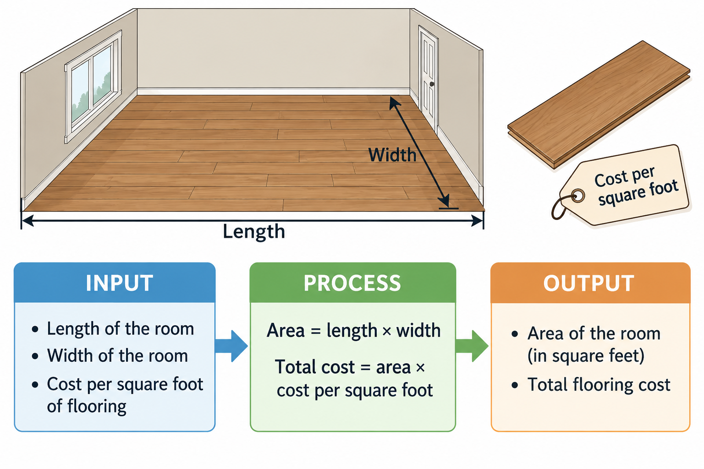

# Practice Problem — Flooring Calculator



## Scenario
You are planning to install new flooring in a rectangular room.

Write a program that asks the user to enter the **length** and **width** of the room in feet. The program should calculate and display the **area of the floor in square feet** to one decimal place.

Before writing the program:

1. Create an **IPO (Input-Processing-Output) chart** for the problem.
2. Create **four sample calculations** using different room lengths and widths.
3. Write and test the Python program.


---

## Step #1: Manually hannd-write four Sample Calculations to help understand the problem

| Length (ft) | Width (ft) | Calculation | Area (sq ft) |
|---:|---:|---|---:|
| 10 | 12 | `10 * 12` | 120 |
| 12 | 15 | `12 * 15` | 180 |
| 14 | 18 | `14 * 18` | 252 |
| 20 | 16 | `20 * 16` | 320 |


## Step #2: Create an IPO Chart  (Input Processing Output)

Note: helpful to define your variable names and calcuations


| Input | Processing | Output |
|---|---|---|
| length of room in feet | `area = length * width` | area of floor in square feet |
| width of room in feet | | |


---

## Step #3: Write the Python code

Don't forget to add comments at the top and also for Input, Processing, and Output


```python
# flooring.py
# Author: Your Name
# Date: September 25, 2026
# Description: Calculate the area of flooring needed for a room.

# Input
length = float(input("Enter the length of the room in feet: "))
width = float(input("Enter the width of the room in feet: "))

# Processing
area = length * width

# Output
print(f"Floor area: {area:.1f} square feet")
```

### Sample Run

```text
Enter the length of the room in feet: 12
Enter the width of the room in feet: 15
Floor area: 180.0 square feet
```

---
